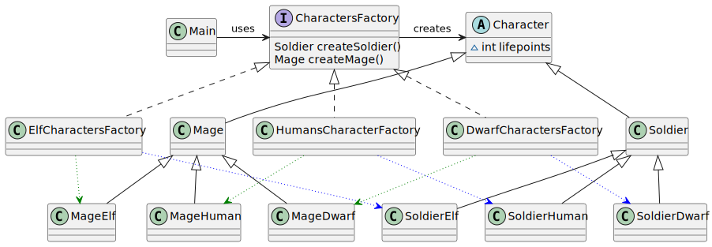

# Abstract Factory pattern

*"Abstract Factory is a creational design pattern that lets you produce families of related objects without specifying their concrete classes."* - [source](https://refactoring.guru/design-patterns/abstract-factory)

## Class diagram



## Example

Main.java:

```java
Mage elfMage = elvesFactory.createMage();
Soldier elfSoldier = elvesFactory.createSoldier();

CharactersFactory dwarvesFactory = new DwarfCharactersFactory();
Mage dwarfMage = dwarvesFactory.createMage();
Soldier dwarfSoldier = dwarvesFactory.createSoldier();

List<Soldier> soldiers = List.of(humanSoldier, elfSoldier, dwarfSoldier);
soldiers.forEach(Soldier::attack);

List<Mage> mages = List.of(humanMage, elfMage, dwarfMage);
mages.forEach(Mage::enchant);
```
Output:

```bash
Human attack!
Elf attacking with arrows!
Dwarf attacking with a hammer
A human mage doing a magic enchant
A magic Elf executing a sorcery
Ancient dwarf mage is doing magic
```