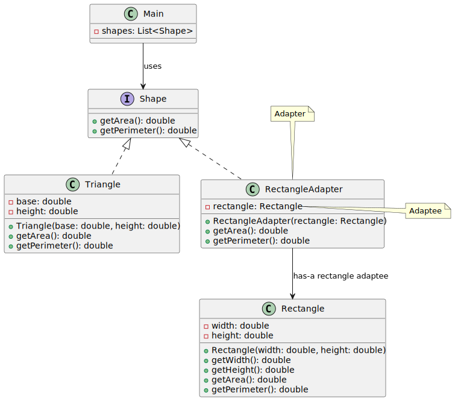

# Adapter pattern

*"Adapter is a structural design pattern that allows objects with incompatible interfaces to collaborate."* - [source](https://refactoring.guru/design-patterns/adapter)

## Class diagram



## Example

Main.java:

```java
Rectangle rectangle = new Rectangle(10, 5);

System.out.println("Rectangle area: " + rectangle.calculateArea());
System.out.println("Rectangle perimeter: " + rectangle.calculatePerimeter());

Shape rectangleAdapter = new RectangleAdapter(rectangle);
System.out.println("RectangleAdapter area: " + rectangleAdapter.getArea());
System.out.println("RectangleAdapter perimeter: " + rectangleAdapter.getPerimeter());

Shape triangle = new Triangle(10, 5);
Shape square = new RectangleAdapter(new Rectangle(2,2));

System.out.println("---- SHAPES ----");
Shape[] shapes = { triangle, square, rectangleAdapter };
for(Shape shape : shapes) {
    System.out.println("Shape " + shape.getClass().getSimpleName());
    System.out.println("Shape area: " + shape.getArea());
    System.out.println("Shape perimeter: " + shape.getPerimeter());
}
```
Output:

```bash
Rectangle area: 50.0
Rectangle perimeter: 30.0
RectangleAdapter area: 50.0
RectangleAdapter perimeter: 30.0
---- SHAPES ----
Shape Triangle
Shape area: 25.0
Shape perimeter: 26.18033988749895
Shape RectangleAdapter
Shape area: 4.0
Shape perimeter: 8.0
Shape RectangleAdapter
Shape area: 50.0
Shape perimeter: 30.0
```