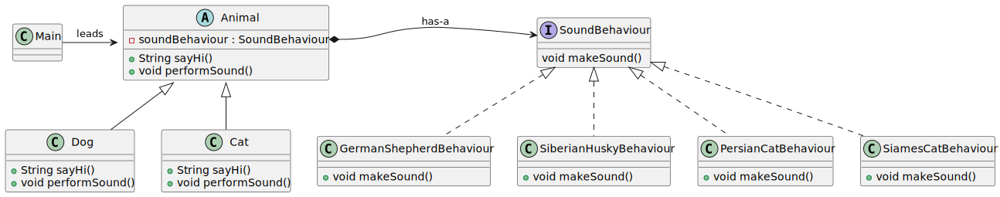

# Bridge pattern

*"Bridge is a structural design pattern that lets you split a large class or a set of closely related classes into two separate hierarchies—abstraction and implementation—which can be developed independently of each other."* - [source](https://refactoring.guru/design-patterns/bridge)

## Class diagram



## Example

Main.java:

```java
Animal germanShepherd = new Dog(new GermanShepherdBehaviour());
System.out.println(germanShepherd.sayHi());
germanShepherd.performSound();

Animal siberianHusky = new Dog(new SiberianHuskyBehaviour());
System.out.println(siberianHusky.sayHi());
siberianHusky.performSound();

Animal siamesCat = new Cat(new SiamesCatBehaviour());
System.out.println(siamesCat.sayHi());
siamesCat.performSound();

Animal persianCat = new Cat(new PersianCatBehaviour());
System.out.println(persianCat.sayHi());
persianCat.performSound();

```
Output:

```bash
I am a dog!
Woof woof! (German Shepherd)
I am a dog!
Woof woof! (Siberian Husky)
I am a cat!
Meow, meowwwwww (Siames)!
I am a cat!
Meow, meow (Persian)!
```