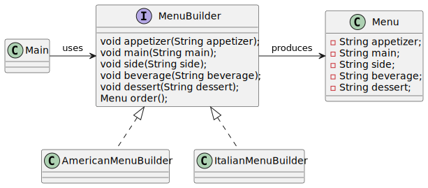

# Builder pattern

*"Builder is a creational design pattern that lets you construct complex objects step by step. The pattern allows you to produce different types and representations of an object using the same construction code."* - [source](https://refactoring.guru/design-patterns/builder)

I implemented two versions of this pattern: classic and fluent.

A third version was also added using [Lombok project](https://www.baeldung.com/intro-to-project-lombok) @Builder annotation.

## Builder pattern (classic version)

## Builder pattern (fluent version)

