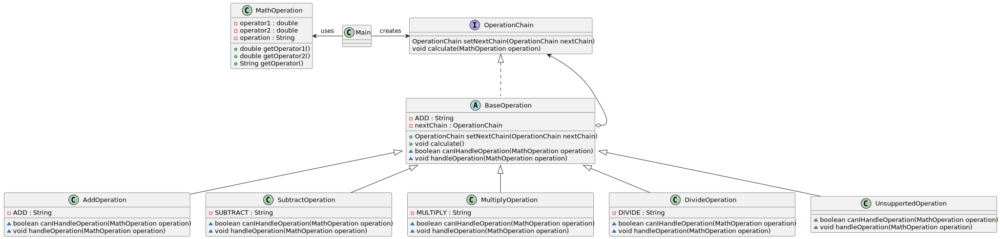

# Chain of Responsibility pattern

*"hain of Responsibility is a behavioral design pattern that lets you pass requests along a chain of handlers. Upon receiving a request, each handler decides either to process the request or to pass it to the next handler in the chain."* - [source](https://refactoring.guru/design-patterns/chain-of-responsibility)

## Class diagram



## Example

Main.java:

```java
OperationChain chain = new AddOperation();
OperationChain sub = new SubstractOperation();
OperationChain mul = new MultiplyOperation();
OperationChain div = new DivideOperation();
OperationChain unsupportedOperation = new UnsupportedOperation();

unsupportedOperation.setNextChain(div);

chain.setNextChain(sub)
        .setNextChain(mul)
        .setNextChain(div)
        .setNextChain(unsupportedOperation);

MathOperation addOperation = new MathOperation(4, 2, AddOperation.ADD);
chain.calculate(addOperation);
MathOperation subOperation = new MathOperation(4, 2, SubstractOperation.SUBSTRACT);
chain.calculate(subOperation);
MathOperation mulOperation = new MathOperation(4, 2, MultiplyOperation.MULTIPLY);
chain.calculate(mulOperation);
MathOperation divOperation = new MathOperation(4, 2, DivideOperation.DIVIDE);
chain.calculate(divOperation);
MathOperation moduleOperation = new MathOperation(4, 2, "MOD"); // not supported
chain.calculate(moduleOperation);
```
Output:

```bash
Addition operation
4 + 2 = 6
Subtraction operation
4 - 2 = 2
Multiplication operation
4 * 2 = 8
Division operation
4 / 2 = 2
Unsupported operation: MOD
```