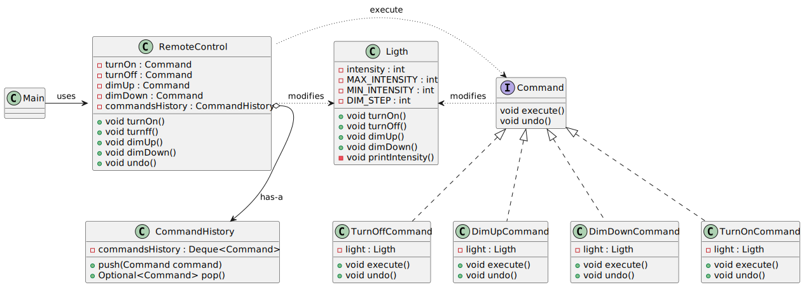

# Command pattern

*"Command is a behavioral design pattern that turns a request into a stand-alone object that contains all information about the request. This transformation lets you pass requests as a method arguments, delay or queue a request’s execution, and support undoable operations."* - [source](https://refactoring.guru/design-patterns/command)

## Class diagram



## Example

Main.java:

```java
Light light = new Light();
Command turnOn = new TurnOnCommand(light);
Command turnOff = new TurnOffCommand(light);
Command dimUp = new DimUpCommand(light);
Command dimDown = new DimDownCommand(light);
RemoteControl remoteControl = new RemoteControl(turnOn, turnOff, dimUp, dimDown);

remoteControl.turnOn();
remoteControl.dimDown();
remoteControl.dimDown();
remoteControl.dimDown();
remoteControl.dimUp();
remoteControl.dimUp();
remoteControl.dimUp();
remoteControl.turnOff();
remoteControl.undo();
remoteControl.undo();
remoteControl.undo();
```
Output:

```bash
Turning on the lights
The light intensity is: 100
Dimming down the lights
The light intensity is: 90
Dimming down the lights
The light intensity is: 80
Dimming down the lights
The light intensity is: 70
Dimming up the lights
The light intensity is: 80
Dimming up the lights
The light intensity is: 90
Dimming up the lights
The light intensity is: 100
Turning off the lights
The light intensity is: 0
Undoing the last command: TurnOffCommand
The light intensity is: 100
Undoing the last command: DimUpCommand
The light intensity is: 90
Undoing the last command: DimUpCommand
The light intensity is: 80
```