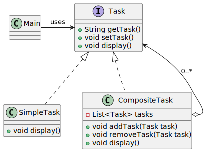

# Composite pattern

*"Composite is a structural design pattern that lets you compose objects into tree structures and then work with these structures as if they were individual objects."* - [source](https://refactoring.guru/design-patterns/composite)

## Class diagram




## Example

Main.java:

```java
Task weeding = new SimpleTask("Weeding");
Task watering = new SimpleTask("Watering");
Task transplanting = new SimpleTask("Transplanting");
Task fertilizing = new SimpleTask("Fertilizing");

Task outdoorTasks = new CompositeTask("Garden maintenance", List.of(weeding, watering, transplanting, fertilizing));

Task vacuuming = new SimpleTask("Vacuuming");
Task dusting = new SimpleTask("Dusting");

Task indoorTasks = new CompositeTask("Indoor house work", List.of(vacuuming, dusting));

Task houseWork = new CompositeTask("House work", new ArrayList<>());
((CompositeTask) houseWork).addTask(indoorTasks);
((CompositeTask) houseWork).addTask(outdoorTasks);

System.out.println("Weekend plan:");
houseWork.display();

System.out.println("Outdoor tasks:");
((CompositeTask) houseWork).removeTask(indoorTasks);
houseWork.display();
```
Output:

```bash
Weekend plan:
Complex task House work:
Complex task Indoor house work:
 - Vacuuming
 - Dusting
Complex task Garden maintenance:
 - Weeding
 - Watering
 - Transplanting
 - Fertilizing
Outdoor tasks:
Complex task House work:
Complex task Garden maintenance:
 - Weeding
 - Watering
 - Transplanting
 - Fertilizing
```