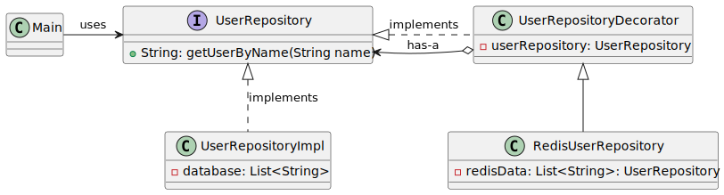

# Decorator pattern

*"Decorator is a structural design pattern that lets you attach new behaviors to objects by placing these objects inside special wrapper objects that contain the behaviors."* - [source](https://refactoring.guru/design-patterns/decorator)

## Class diagram



## Example

Main.java:

```java
List<String> usersData = new ArrayList<>(Arrays.asList("Mike", "Robert", "Martin"));

UserRepository database = new UserRepositoryImpl(usersData);
RedisUserRepository redisCache = new RedisUserRepository(database);
redisCache.addUser("Mike");

redisCache.getUserByName("Robert");
redisCache.getUserByName("Mike");
redisCache.getUserByName("NotFound");
```
Output:

```bash
Searching in redis: 'Robert'
Redis result: 'null'
Searching in database: 'Robert'
Database result: 'Robert'
Searching in redis: 'Mike'
Redis result: 'Mike'
Searching in redis: 'NotFound'
Redis result: 'null'
Searching in database: 'NotFound'
Database result: 'null'
```