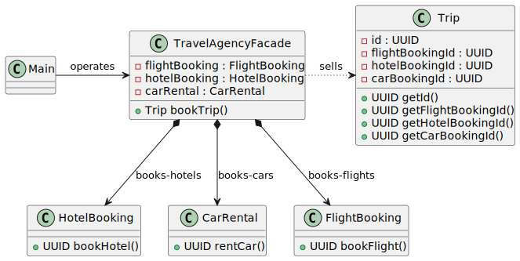

# Facade pattern

*"Facade is a structural design pattern that provides a simplified interface to a library, a framework, or any other complex set of classes."* - [source](https://refactoring.guru/design-patterns/facade)

## Class diagram



## Example

Main.java:

```java
System.out.println("Facade Pattern: Travel Agency");
TravelAgencyFacade travelAgencyFacade = new TravelAgencyFacade();
Trip trip = travelAgencyFacade.bookTrip();
System.out.println("Trip booked: " + trip);
```
Output:

```bash
Facade Pattern: Travel Agency
Flight booked: 2b6188c3-6f0b-4f0a-a4bb-18af92c2ab81
Hotel booked: 4d459369-2628-4e17-a425-20bbd48a868e
Car rented: f39e4212-6c94-4917-9256-398e19f15536
Trip booked: Trip{id=160e47d8-c2a4-428b-9e45-4eb5582c247d, flightBookingId=2b6188c3-6f0b-4f0a-a4bb-18af92c2ab81, hotelBookingId=4d459369-2628-4e17-a425-20bbd48a868e, carBookingId=f39e4212-6c94-4917-9256-398e19f15536}
```