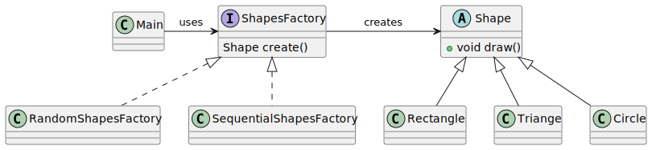

# Factory Method pattern

*"Factory Method is a creational design pattern that provides an interface for creating objects in a superclass, but allows subclasses to alter the type of objects that will be created."* - [source](https://refactoring.guru/design-patterns/factory-method)

## Class diagram



## Example

Main.java:

```java
System.out.println("RANDOM ----------");
ShapesFactory randomFactory = new RandomShapesFactory();
List<Shape> randomShapes = new ArrayList<>();
randomShapes.add(randomFactory.create());
randomShapes.add(randomFactory.create());
randomShapes.add(randomFactory.create());
randomShapes.forEach(Shape::draw);


System.out.println("SEQUENTIAL ----------");
ShapesFactory sequentialFactory = new SequentialShapesFactory();
List<Shape> sequentialShapes = new ArrayList<>();
sequentialShapes.add(sequentialFactory.create());
sequentialShapes.add(sequentialFactory.create());
sequentialShapes.add(sequentialFactory.create());
sequentialShapes.add(sequentialFactory.create());
sequentialShapes.add(sequentialFactory.create());
sequentialShapes.add(sequentialFactory.create());
sequentialShapes.forEach(Shape::draw);
```
Output:

```bash
RANDOM ----------
TRIANGLE
RECTANGLE
CIRCLE
SEQUENTIAL ----------
RECTANGLE
TRIANGLE
CIRCLE
RECTANGLE
TRIANGLE
CIRCLE
```