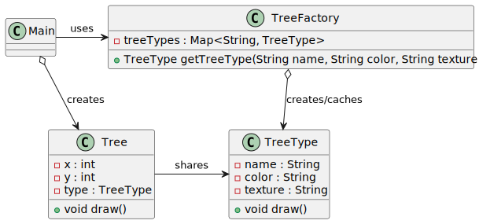

# Flyweight pattern

*"Flyweight is a structural design pattern that lets you fit more objects into the available amount of RAM by sharing common parts of state between multiple objects instead of keeping all of the data in each object."* - [source](https://refactoring.guru/design-patterns/flyweight)

## Class diagram



## Example

Main.java:

```java
        List<Tree> forest = new ArrayList<>();
        forest.add(new Tree(1, 1, "Oak", "Green", "Hardwood"));
        forest.add(new Tree(2, 2, "Pine", "Green", "Softwood"));
        forest.add(new Tree(3, 3, "Maple", "Red", "Hardwood"));
        forest.add(new Tree(4, 4, "Oak", "Green", "Hardwood"));
        forest.add(new Tree(5, 5, "Pine", "Green", "Softwood"));
        forest.add(new Tree(6, 6, "Maple", "Red", "Hardwood"));
        forest.add(new Tree(7, 7, "Oak", "Green", "Hardwood"));
        forest.add(new Tree(8, 8, "Pine", "Green", "Softwood"));
        forest.add(new Tree(9, 9, "Maple", "Red", "Hardwood"));

        forest.forEach(Tree::draw);
```
Output:

```bash
Drawing a tree at 1, 1 with type {Name: Oak, Color: Green, Texture: Hardwood,  770184583}
Drawing a tree at 2, 2 with type {Name: Pine, Color: Green, Texture: Softwood,  1784975138}
Drawing a tree at 3, 3 with type {Name: Maple, Color: Red, Texture: Hardwood,  1359488151}
Drawing a tree at 4, 4 with type {Name: Oak, Color: Green, Texture: Hardwood,  770184583}
Drawing a tree at 5, 5 with type {Name: Pine, Color: Green, Texture: Softwood,  1784975138}
Drawing a tree at 6, 6 with type {Name: Maple, Color: Red, Texture: Hardwood,  1359488151}
Drawing a tree at 7, 7 with type {Name: Oak, Color: Green, Texture: Hardwood,  770184583}
Drawing a tree at 8, 8 with type {Name: Pine, Color: Green, Texture: Softwood,  1784975138}
Drawing a tree at 9, 9 with type {Name: Maple, Color: Red, Texture: Hardwood,  1359488151}
```