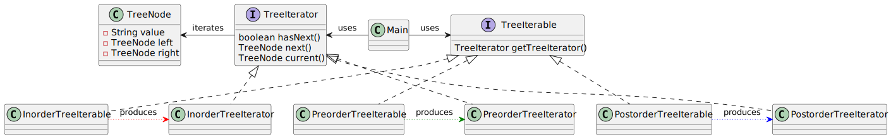

# Iterator pattern

*"Iterator is a behavioral design pattern that lets you traverse elements of a collection without exposing its underlying representation (list, stack, tree, etc.)."* - [source](https://refactoring.guru/design-patterns/iterator)

## Class diagram

