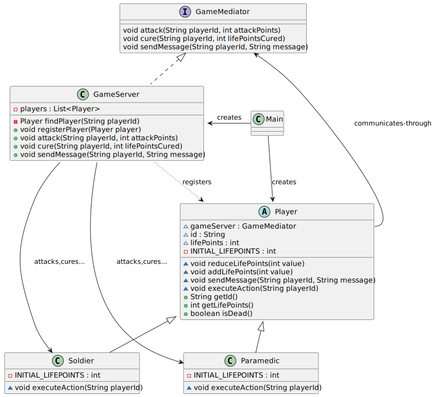

# Mediator pattern

*"Mediator is a behavioral design pattern that lets you reduce chaotic dependencies between objects. The pattern restricts direct communications between the objects and forces them to collaborate only via a mediator object."* - [source](https://refactoring.guru/design-patterns/mediator)

## Class diagram



## Example

Main.java:

```java
GameServer gameServer = new GameServer();

Player soliderA1 = new Soldier(gameServer, "soliderA1");
Player soliderA2 = new Soldier(gameServer, "soliderA2");
Player paramedicA = new Paramedic(gameServer, "paramedicA");

Player soliderB1 = new Soldier(gameServer, "soliderB1");
Player soliderB2 = new Soldier(gameServer, "soliderB2");

gameServer.registerPlayer(soliderA1);
gameServer.registerPlayer(soliderA2);
gameServer.registerPlayer(soliderB1);
gameServer.registerPlayer(soliderB2);
gameServer.registerPlayer(paramedicA);

soliderA1.executeAction(soliderB1.getId());
soliderB2.executeAction(soliderA2.getId());
paramedicA.executeAction(soliderA1.getId());

soliderB2.executeAction(soliderA2.getId());
soliderB1.executeAction(soliderA2.getId());
soliderB2.executeAction(soliderA2.getId());
soliderB1.executeAction(soliderA2.getId());
soliderB1.sendMessage(soliderA2.getId(), "I killed you!");
paramedicA.executeAction(soliderA2.getId());
```
Output:

```bash
Player soliderB1 attached with 10
Player soliderB1 has 40 life points remaining
Player soliderA2 attached with 10
Player soliderA2 has 40 life points remaining
Player soliderA1 is cured with 10 - now 60 life points
Player soliderA2 attached with 10
Player soliderA2 has 30 life points remaining
Player soliderA2 attached with 10
Player soliderA2 has 20 life points remaining
Player soliderA2 attached with 10
Player soliderA2 has 10 life points remaining
Player soliderA2 attached with 10
Attach result: Player soliderA2 is dead
Message to soliderA2: I killed you!
Player soliderA2 is cured with 10 - now 10 life points
Player soliderA2 is back to life with 10 life points
```