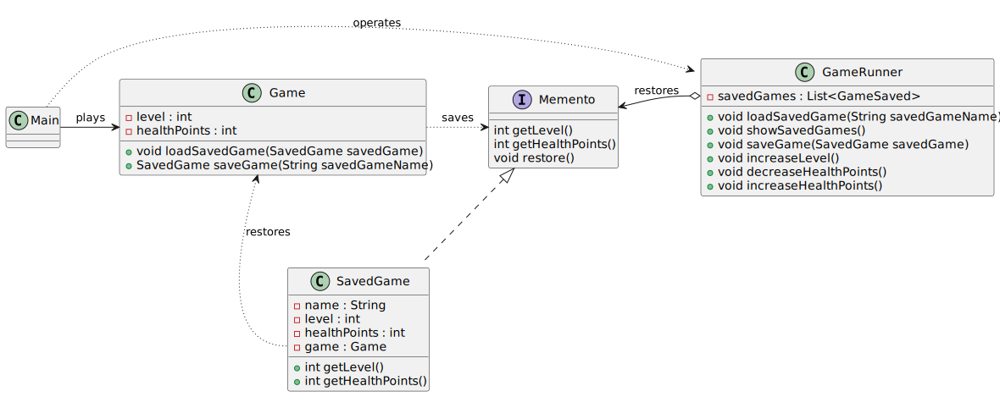

# Memento pattern

*"Memento is a behavioral design pattern that lets you save and restore the previous state of an object without revealing the details of its implementation."* - [source](https://refactoring.guru/design-patterns/memento)

## Class diagram



## Example

Main.java:

```java
Game game = new Game();
GameRunner gameRunner = new GameRunner();
game.decreaseHealthPoints();
game.decreaseHealthPoints();
game.increaseLevel();
gameRunner.saveGame(game.saveGame("Level 1 completed"));
game.increaseLevel();
gameRunner.saveGame(game.saveGame("Level 2 completed"));
game.decreaseHealthPoints();
gameRunner.showGamesSaved();
gameRunner.loadSavedGame("Level 2 completed");
```
Output:

```bash
Health points: 20
Health points: 10
Congratulations, level completed!
Current level: 2
Saving game: [Level 1 completed Level: 2 Health points: 10]
Congratulations, level completed!
Current level: 3
Saving game: [Level 2 completed Level: 3 Health points: 10]
Health points: 0
Game over
Level 1 completed
Level 2 completed
Game loaded: [Level 2 completed Level: 3 Health points: 10]
```