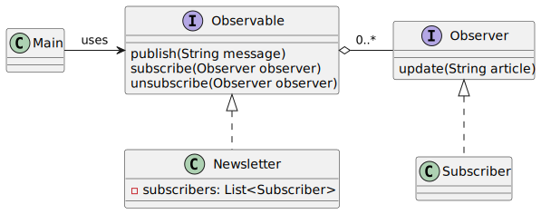

# Observer pattern

*"Observer is a behavioral design pattern that lets you define a subscription mechanism to notify multiple objects about any events that happen to the object they’re observing."* - [source](https://refactoring.guru/design-patterns/observer)

## Class diagram



## Example

Main.java:

```java
Newsletter jobsPortal = new Newsletter();

Subscriber recruiter = new Subscriber("Recruiter");
Subscriber jobSeeker = new Subscriber("Job Seeker");
Subscriber company = new Subscriber("Company XYZ");

jobsPortal.subscribe(recruiter);
jobsPortal.subscribe(jobSeeker);
jobsPortal.subscribe(company);

jobsPortal.publish("New vacancy at CoolCompany!");

jobsPortal.unsubscribe(recruiter);
jobsPortal.publish("Update for companies and job seekers only!");
```
Output:

```bash
Recruiter article received: New vacancy at CoolCompany!
Job Seeker article received: New vacancy at CoolCompany!
Company XYZ article received: New vacancy at CoolCompany!
Job Seeker article received: Update for companies and job seekers only!
Company XYZ article received: Update for companies and job seekers only!
```