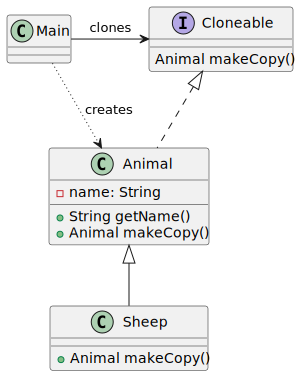

# Prototype pattern

*"Prototype is a creational design pattern that lets you copy existing objects without making your code dependent on their classes."* - [source](https://refactoring.guru/design-patterns/prototype)

## Class diagram



## Example

Main.java:

```java
Animal originalSheep = new Sheep("Original Sheep");
Animal dolly = originalSheep.makeCopy();
System.out.println("Original: " + originalSheep);
System.out.println("Dolly: " + dolly);
```
Output:

```bash
Original: Sheep{ 'Original Sheep': 146589023 }
Dolly: Sheep{ 'Original Sheep': 1442407170 }
```