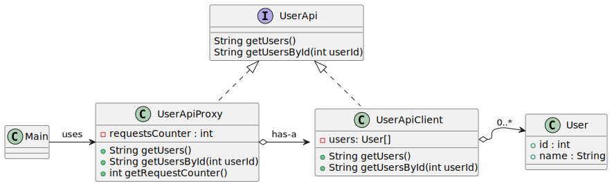

# Proxy pattern

*"Proxy is a structural design pattern that lets you provide a substitute or placeholder for another object. A proxy controls access to the original object, allowing you to perform something either before or after the request gets through to the original object."* - [source](https://refactoring.guru/design-patterns/proxy)

## Class diagram



## Example

Main.java:

```java
UserApiProxy userApiProxy = new UserApiProxy();

User[] users = userApiProxy.getUsers();
System.out.println("All users: ");
Arrays.stream(users).forEach(user -> System.out.println(user));

User mike = userApiProxy.getUsers(1);
System.out.println("User with id 1: " + mike);

User john  = userApiProxy.getUsers(2);
System.out.println("User with id 2: " + john);

User jane = userApiProxy.getUsers(3);
System.out.println("User with id 3: " + jane);

System.out.println("Requests counter: " + userApiProxy.getRequestCounter());
```
Output:

```bash
All users: 
User[id=1, name=Mike]
User[id=2, name=John]
User[id=3, name=Jane]
User with id 1: User[id=1, name=Mike]
User with id 2: User[id=2, name=John]
User with id 3: User[id=3, name=Jane]
Requests counter: 4
```