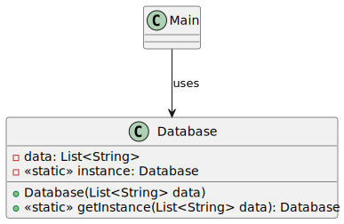

# Singleton pattern

*"Singleton is a creational design pattern that lets you ensure that a class has only one instance, while providing a global access point to this instance."* - [source](https://refactoring.guru/design-patterns/singleton)

## Class diagram



## Example

Main.java:

```java
System.out.println("----- Single thread Database example -----");
List<String> data = Arrays.asList("Hello", "world!");
// Database database = new Database(data); // Forbidden (private constructor)
Database database = Database.getInstance(data);
System.out.println(database);

System.out.println("----- Multithreaded Database example -----");
Thread foo = new Thread(new ThreadFoo());
Thread bar = new Thread(new ThreadBar());
foo.start();
bar.start();
```
Output:

```bash
----- Single thread Database example -----
Hello world!
----- Multithreaded Database example -----
Foo example
Foo example
```