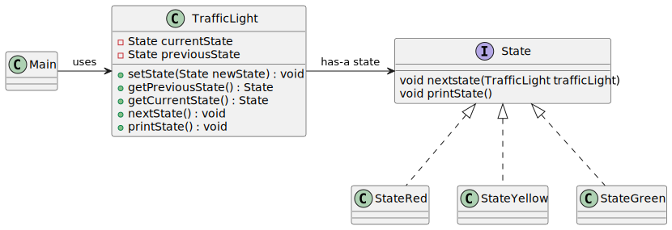

# State pattern

*"State is a behavioral design pattern that lets an object alter its behavior when its internal state changes. It appears as if the object changed its class."* - [source](https://refactoring.guru/design-patterns/state)

## Class diagram



## Example

Main.java:

```java
TrafficLight trafficLight = new TrafficLight();

int count = 0;
while(count < 10) {
    try {
        trafficLight.printState();
        trafficLight.nextState();
        Thread.sleep(1000);
        count++;
    } catch (InterruptedException e) {
        e.printStackTrace();
        break;
    }
}
```
Output:

```bash
RED
YELLOW
GREEN
YELLOW
RED
YELLOW
GREEN
YELLOW
RED
YELLOW
```