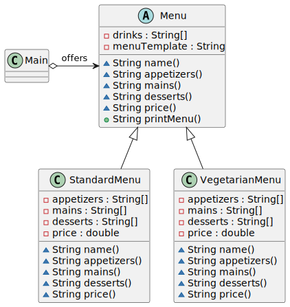

# Template Method pattern

*"Mediator is a behavioral design pattern that lets you reduce chaotic dependencies between objects. The pattern restricts direct communications between the objects and forces them to collaborate only via a mediator object."* - [source](https://refactoring.guru/design-patterns/template-method)

## Class diagram



## Example

Main.java:

```java
System.out.println("Welcome to the Italian Restaurant");
List<Menu> menus = List.of(new StandardMenu(), new VegetarianMenu());

menus.forEach(menu -> {
    System.out.println();
    System.out.println(menu.printMenu());
});
```
Output:

```bash
Welcome to the Italian Restaurant

--------------------
Menu: Daily Menu
--------------------
Drinks:
Water, Soda, Beer, Wine
--------------------
Appetizer:
Bruschetta, Calamari, Caprese Salad
--------------------
Main:
Spaghetti Carbonara, Chicken Parmesan, Lasagna
--------------------
Dessert:
Tiramisu, Cannoli, Gelato
--------------------
Price: 10.00 EUR
--------------------


--------------------
Menu: Vegetarian Menu
--------------------
Drinks:
Water, Soda, Beer, Wine
--------------------
Appetizer:
Bruschetta, Caprese Salad
--------------------
Main:
Spaghetti Pomodoro, Eggplant Parmesan, Fettuccine Alfredo
--------------------
Dessert:
Tiramisu, Cannoli, Gelato
--------------------
Price: 12.00 EUR
--------------------
```