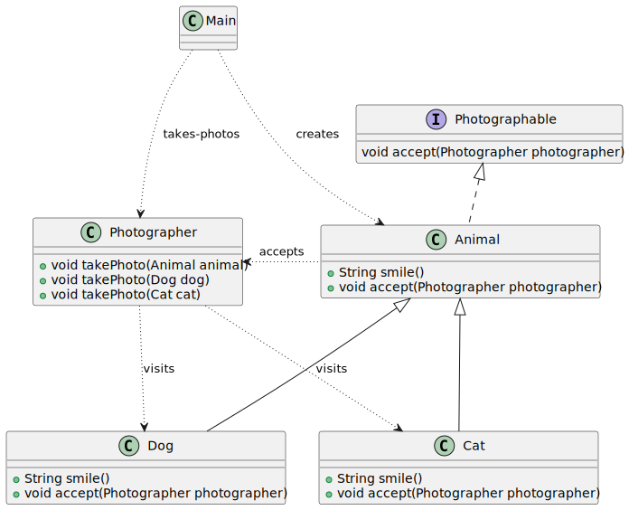

# Visitor pattern

*"Visitor is a behavioral design pattern that lets you separate algorithms from the objects on which they operate."* - [source](https://refactoring.guru/design-patterns/visitor)

## Class diagram



## Example

Main.java:

```java
List<Animal> animals = List.of(new Dog(), new Cat());
Photographer photographer = new Photographer();

System.out.println("Single dispatch: Photographer::takePhoto(Animal animal) method used");
animals.forEach(photographer::takePhoto);

System.out.println("Double dispatch: Photographer::takePhoto(Cat/Dog xxx) method used");
animals.forEach(animal -> {
    animal.accept(photographer);
});
```
Output:

```bash
Single dispatch: Photographer::takePhoto(Animal animal) method used
An animal photo: Dog is smiling
An animal photo: Cat is smiling
Double dispatch: Photographer::takePhoto(Cat/Dog xxx) method used
A dog photo: Dog is smiling
A cat photo: Cat is smiling
```